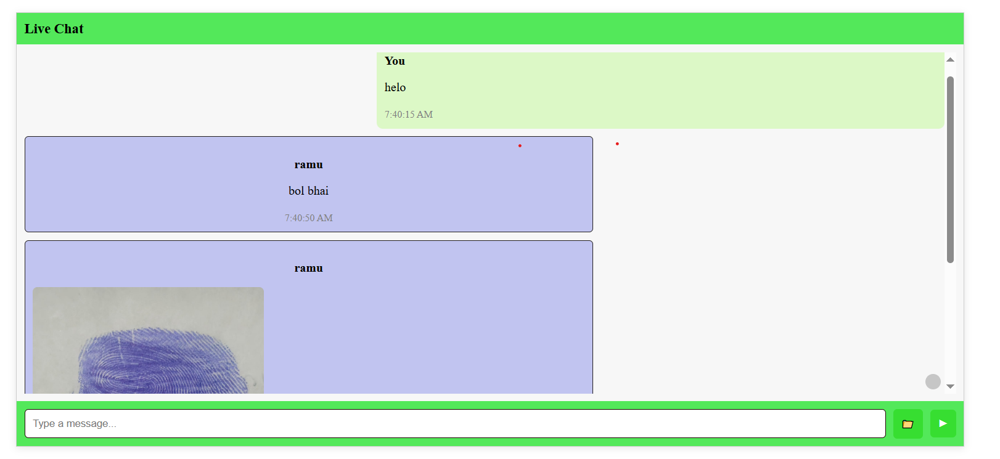

# Chat Application with File & Image Upload

## Description

This is a realtime chat application built with React.js and Node.js, featuring:

- Real-time messaging via Socket.io
- File and image uploads handled through AWS S3 storage
- Responsive UI
- Secure, scalable backend with cloud storage

---

## Features

- Text chat in rooms with usernames
- Upload images, videos, PDFs, Word documents
- Other file types show clickable download links
- Smooth chat scroll and user-friendly interface
---

## Setup Instructions

### Backend

Create `.env` in `/server` folder:

### Frontend

Create `.env` in `/client` folder:

---

## Deployment

The app is deployed live at:

[https://mychat-client.onrender.com](https://mychat-client.onrender.com)

Chat, upload images/files, and test it in real time from any device!

